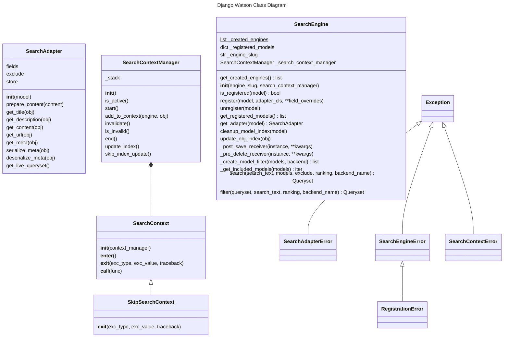
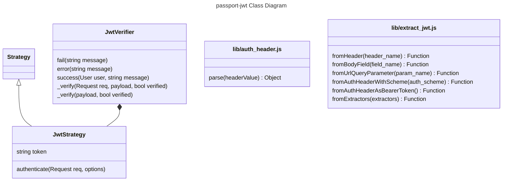

## Class Diagrams

### [Django Watson](https://github.com/etianen/django-watson)

```mermaid
---
title: Django Watson Class Diagram
---
classDiagram
class SearchAdapter {
  fields
  exclude
  store
  __init__(model)
  prepare_content(content)
  get_title(obj)
  get_description(obj)
  get_content(obj)
  get_url(obj)
  get_meta(obj)
  serialize_meta(obj)
  deserialize_meta(obj)
  get_live_queryset()
}

class SearchContextManager {
  _stack
  __init__()
  is_active()
  start()
  add_to_context(engine, obj)
  invalidate()
  is_invalid()
  end()
  update_index()
  skip_index_update()
}

class SearchContext {
  __init__(context_manager)
  __enter__()
  __exit__(exc_type, exc_value, traceback)
  __call__(func)
}

class SkipSearchContext {
  __exit__(exc_type, exc_value, traceback)
}

class SearchEngine {
  list _created_engines$
  dict _registered_models
  str _engine_slug
  SearchContextManager _search_context_manager
  get_created_engines()$ list
  __init__(engine_slug, search_context_manager)
  is_registered(model) bool
  register(model, adapter_cls, **field_overrides)
  unregister(model)
  get_registered_models() list
  get_adapter(model) SearchAdapter
  cleanup_model_index(model)
  update_obj_index(obj)
  _post_save_receiver(instance, **kwargs)
  _pre_delete_receiver(instance, **kwargs)
  _create_model_filter(models, backend) list
  _get_included_models(models) iter
  search(search_text, models, exclude, ranking, backend_name) Queryset
  filter(queryset, search_text, ranking, backend_name) Queryset
}

Exception <|-- SearchAdapterError
Exception <|-- SearchEngineError
Exception <|-- SearchContextError
SearchEngineError <|-- RegistrationError
SearchContextManager *-- SearchContext
SearchContext <|-- SkipSearchContext
```

### [Passport JWT](https://github.com/mikenicholson/passport-jwt)

```mermaid
---
title: passport-jwt Class Diagram
---
classDiagram
class Strategy
class JwtStrategy {
  string token
  authenticate(Request req, options)
}
class JwtVerifier {
  fail(string message)
  error(string message)
  success(User user, string message)
  _verify(Request req, payload, bool verified)
  _verify(payload, bool verified)
}

class libAuthHeader["lib/auth_header.js"] {
  parse(headerValue) Object
}

class libExtractJwt["lib/extract_jwt.js"] {
  fromHeader(header_name) Function
  fromBodyField(field_name) Function
  fromUrlQueryParameter(param_name) Function
  fromAuthHeaderWithScheme(auth_scheme) Function
  fromAuthHeaderAsBearerToken() Function
  fromExtractors(extractors) Function
}

Strategy <|-- JwtStrategy
JwtVerifier *-- JwtStrategy
```
