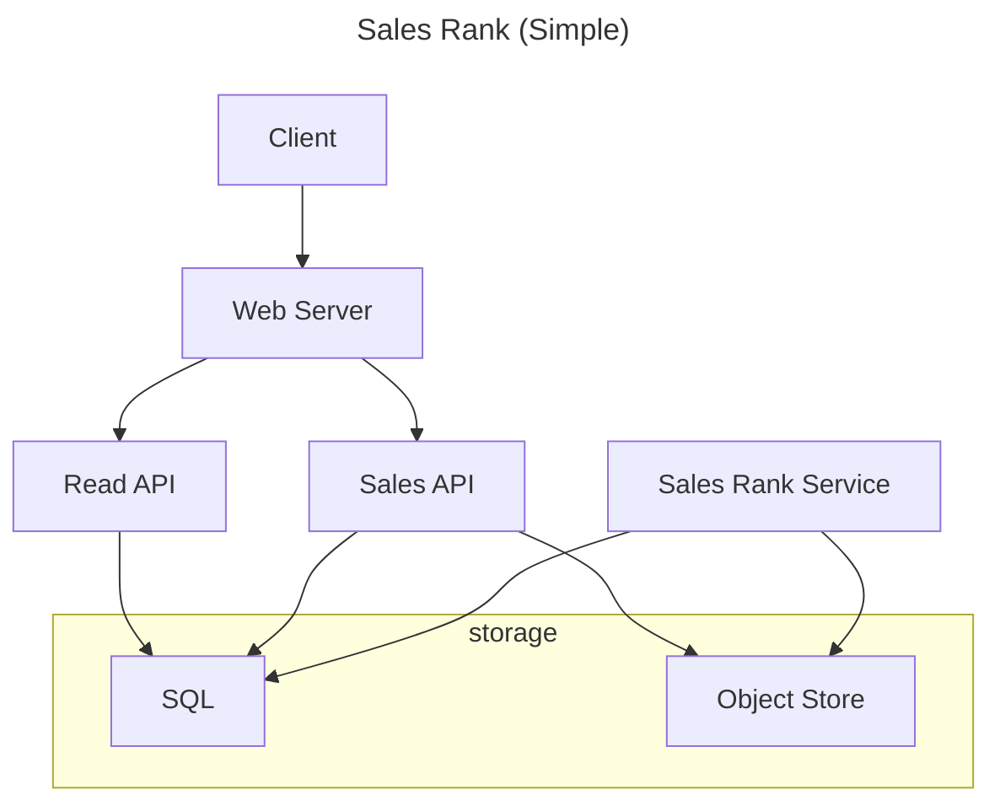
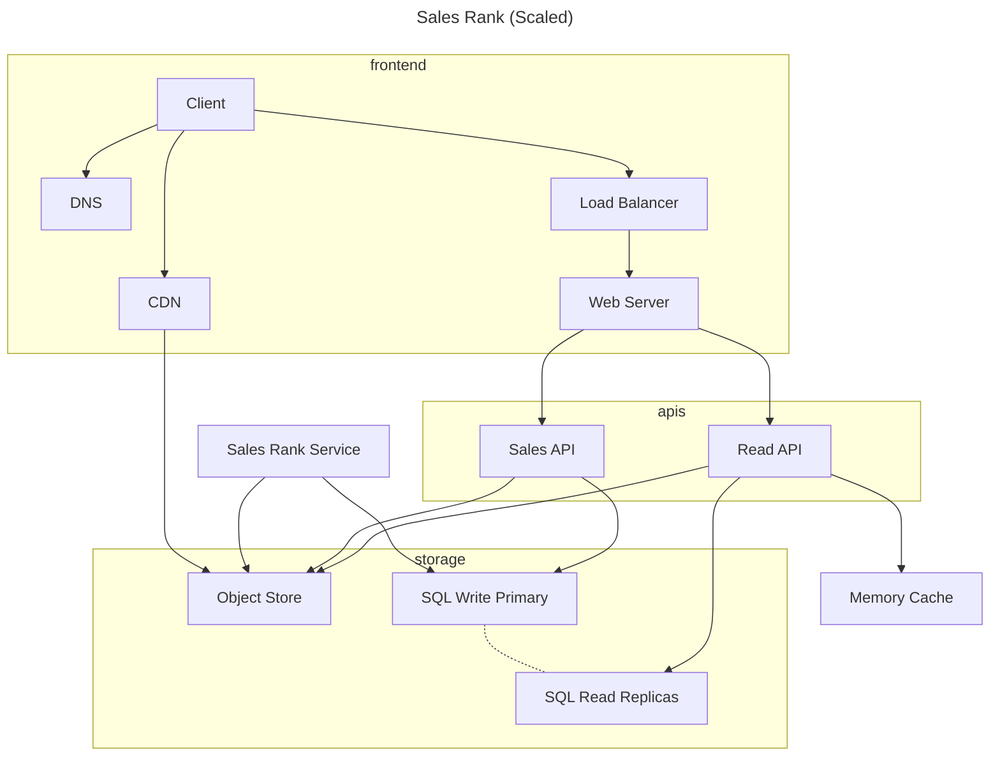

## System Design Diagrams
Diagrams are based on the diagrams in the [System Design Primer](https://github.com/donnemartin/system-design-primer/tree/master/solutions/system_design)

### [Mint](https://github.com/donnemartin/system-design-primer/tree/master/solutions/system_design/mint)

### [Sales Rank](https://github.com/donnemartin/system-design-primer/tree/master/solutions/system_design/sales_rank)

